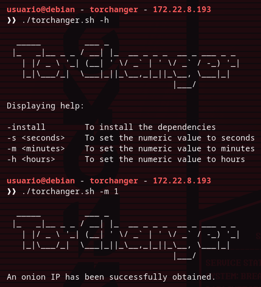

# TorChanger - A script to change your public IP address through time

## Overview

TorChanger is a script I made to mask my public IP when I create queries to any kind of server. It connects to the Tor network and, whenever you specify it in the command, it reboots the connection to change your IP address for another different.

## Starting the script

You need to give the script the permissions to use it.
```bash
git clone https://github.com/daemoncibsec/torchanger.git
cd torchanger
chmod +x torchanger.sh
```

And the syntax to use the script is:

```bash
./torchanger (hour, minute or second) (numeric value)
```

## How does it work?

Anonsurf service to navigate through a Tor tunnel, masking you public IP in the process. Now, we all know (or i hope so) that certain entities have taken over the Tor network creating nodes on it and controlling the packets navigating through the network, and there are many solutions to keep you anonymity, and one of them is, changing your IP address constantly, so servers can't really identify where the petition is comming from. However, this can also be dangerous, because changing your IP address continously over time can get your original public IP address filtered between the connections when the service is rebooting, so I suggest you either use this tool consciously oruse the original Anonsurf service, which works completly fine, since this project is just for practicing my skills with bash scripting.

## Usage example



## Credits

- Anonsurf - [Anonsurf](https://github.com/Und3rf10w/kali-anonsurf)
